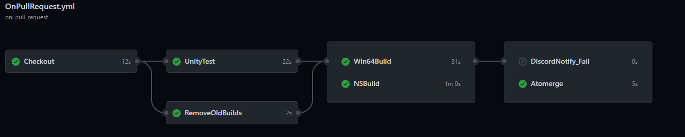
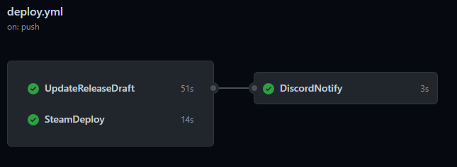
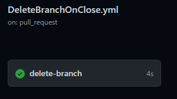

<h1 align="center">
  遊戲開發CICD範例
</h1>

## 前言
這個範例是依據我們專案的CICD需求所設計，這邊也記錄一些基礎知識，
包含使用的工具、Unity自動化建置、測試等。理解做法與原理後，可以按照需求自由的調整。

## 關於Github Action
原先我們使用Jenkins，但使用Github Action可以使工作更集中在統一的系統上。

Github Action是個非常容易使用的Github Repository自動化服務。
通常是透過Github提供的虛擬機/容器執行，但也能使用自己的PC/MAC運行(Self-Hosted Runner)，
再透過Github Action調用。

使用Github提供的虛擬機，每次進行CI建置時都是從乾淨的空容器開始，
當專案規模太大時，每次重新開啟容器、導入Libary或額外的工具，會導致CI時間相對長，
Self-Hosted就可以簡單的只對差異的部分進行建置，機器的性能也能弄得比虛擬機好。

Github Action的虛擬機並非完全免費，每個月有限額度(免費版一個月2000分鐘)。 
Linux外的虛擬機的費用是非常高的(Windows兩倍、MacOS10倍)，
這也是其中一個我們選擇Self-Hosted的原因。

- [關於Github Action的付費(官方文件)](https://docs.github.com/cn/free-pro-team@latest/github/setting-up-and-managing-billing-and-payments-on-github/about-billing-for-github-actions)

## 用途

### 當Pull Request在指定Branch發生時:


1. Checkout指定Branch的Repository至 `$GITHUB_WORKSPACE`
2. 跑Unity TestRun PlayMode以及EditorMode
3. 移除上次Build的檔案
4. Unity Build Windows與Switch版本
5. 以上成功後，自動Merge 
6. 如果以上失敗會在Discord進行失敗通知

### 當Merge成功時:



1. 將Windows Build上傳至Steam
2. 依照PullRequest的內容自動更新Release Note草稿
3. 在Disocrd進行成功通知

### 當Pull Reqeust Close時(通常也就是merge成功時):



1. 刪除已經Merge的Pull Request來源Branch

實際上也可以透過Github Repository的設定來自動刪除Branch，但我想要全部都掌控在
 - [Github管理分支自動刪除](https://docs.github.com/cn/free-pro-team@latest/github/administering-a-repository/managing-the-automatic-deletion-of-branches)

## 限制
如果你使用的是Unity Personal版本，大中華區的用戶有每三日需要登入一次的問題，
這個問題目前沒有work around。CICD省去的時間與精神力，是值得付費Unity的。

## 依賴的Action
| Action  | 用途  | 狀態 |
| ------------ | ------------ | ----------|
| [Checkout](https://github.com/actions/checkout "Checkout")| 將Repository checks-out 至 `$GITHUB_WORKSPACE` 下 | |
| [Release Drafter](https://github.com/release-drafter/release-drafter)  | 依照Pull Reqeust的資訊，自動產生Release Note  ||
| [Actions Status Discord](https://github.com/sarisia/actions-status-discord "Actions Status Discord")  | 透過Webhook在Discord發出訊息  ||
| [Automerge-action](https://github.com/pascalgn/automerge-action "Automerge-action")  | 自動Merge Pull Request  ||
| [Remove File](https://github.com/JesseTG/rm "Remove File")  | 全平台移除檔案或資料夾  ||
| [Delete merged branch](https://github.com/SvanBoxel/delete-merged-branch "Delete merged branch")  | 移除Merge後的Branch  ||


## 設定檢查清單
- ✅ Unity環境安裝
    - ✅ 在本地安裝 指定版本Unity Editor
    - ✅ Switch Unity擴充安裝 (如果有Switch Build)
- ✅ [Unity Build Script 製作與測試](#unity-build-script)
    - ✅ 建立Unity Build Script - Windows
    - ✅ BuildScript測試 - Windows
    - ✅ 建立Unity Build Script - Switch (如果有Switch Build)
    - ✅ BuildScript測試 - Switch  (如果有Switch Build)
- ✅ [Steam Deploy 設置](#steam-deploym)
    - ✅ 本地下載Steam SDK Tools 
    - ✅ 設定Steam App Build Script 並放入 repo
    - ✅ 設定Steam Depot Build Script 並放入 repo
    - ✅ 首次登入 Steam cmd 解決 Steam Gaurd
    - ✅ Deploy測試
- ✅ [Github Action Self-Hosted Runner設定](#self-hosted-runner)
- ✅ 建立`.yml`
    - ✅ [OnPullRequest](#onpullrequestyml)
    - ✅ [DeleteBranchOnClose](#deletebranchoncloseyml)
    - ✅ [Deploy](#deployyml)
    - ✅ [AutoMergeAfterReview](#automergeafterreviewyml) (如果有開啟Pull Reqeust必須Review)
- ✅ Github Secret 全域變數設定
    - ✅ [BUILD_PATH](#deletebranchoncloseyml) : Build相對路徑
    - ✅ [UNITY_PATH](#onpullrequestyml) : Unity絕對路徑
    - ✅ [MY_TOKEN](#onpullrequestyml) : AutoMerge的Personal Token (不可以是 `Admin` 權限)
    - ✅ [STEAMCMD](#deployyml) : steamcmd絕對路徑
    - ✅ [STEAMSCRIPT](#deployyml) : Steam Build Script相對路徑
    - ✅ [STEAMUSERNAME](#deployyml) : steamcmd使用的帳號
    - ✅ [STEAMPASSWORD](#deployyml) : steamcmd使用的密碼
    - ✅ [DISCORD_WEBHOOK](#discord-webhook) : 指定Discord通知頻道的Webhook
- ✅ [Pull Request Require Check設定](#pull-request-require-check)
- ✅ [Release Drafter 設定](#release-drafter)
    - ✅ 建立並設定 `release-drafter.yml`
    - ✅ Pull Reqeust Label設定
- ✅ [IL2CPP](#unity-il2cpp-)
    - ✅ 安裝Windows 10 SDK
    - ✅ 安裝IL2CCP Unity擴充
    - ✅ 從Unity Hub安裝Visual Studio
    
        


--------------------------------------------------------------------------------------------

### Unity Build Script設定
在專案資料夾: Assets/Editor 中建立一個Build腳本，裡面寫build用的method(這個範例有Win64以及Switch兩個Build Method):
```
using System.Linq;
using UnityEditor;

public class CI
{
    [MenuItem("CI/Win64Build")]
    public static void Win64Build()
    {
#if UNITY_EDITOR
        BuildPipeline.BuildPlayer(ScenePaths, "Build/TestProject.exe", BuildTarget.StandaloneWindows64,
            BuildOptions.None);
#endif
    }
    [MenuItem("CI/SwitchBuild")]
    static void SwitchBuild()
    {

#if UNITY_EDITOR
        BuildPipeline.BuildPlayer(ScenePaths, "NSbuilds/TestProject", BuildTarget.Switch, BuildOptions.Development);
#endif
    }

    static string[] ScenePaths => EditorBuildSettings.scenes.Select(scene => scene.path).ToArray();
}
```

在Consle中執行這段就能執行指定目標平台以及Class的Method(在Github Action中也是這樣去執行):
```
"C:\你的Unity\資較夾路徑\Unity.exe"  -quit -batchmode -projectPath=你的\專案\路徑   -buildTarget Win64  -nographics  -executeMethod CI.Win64Build -logFile -
```
細節可以看官方文件:
- [Unity Command Line Arguments](https://docs.unity3d.com/Manual/CommandLineArguments.html)

-----------------------------------------------------------------------------
### Self-Hosted Runner設定

1. 開啟Github Repository網頁 `Settings` > `Actions`
2. `Self-hosted runners` 的欄位中選擇 `Add runner` 按鈕
3. 打開`PowerShell` 移動到系統根目錄(例:C:\\)，按照頁面設定 (跟著步驟複製貼上就對了)

中間會問你 「Enter name of work folder:」 這個是設定之後workrun的根目錄資料夾，很重要所以請記得與注意

最後會問你 「Would you like to run the runner as service? (Y/N)」
如果你回答Y，那這個Runner將會以Windows服務的形式，在背景運行。

這並非必要，你也可已透過`run.cmd`來運行

注意:在設定的過程中PowerShell可能會顯示:出現「因為這個系統上已停用指令碼執行...」，因為系統預設是有限制的，所以請輸入以下指令來解除限制:

```
Set-ExecutionPolicy RemoteSigned
```

-----------------------------------------------------------------------------

### WorkFlow設定
在Gitub Repository中的 `/.github/workflows/`路徑中建立 `.yml` 文件來定義自動化的內容，每一個文件及是一個`Work Flow`

這個範例是由三個Work Flow組成，分別是:

| Workflow  | 時機與用途 | 
| ------------ | ------------ | 
| [OnPullRequest](#onpullrequest設定)| 在Pull Request建立時，進行檢查與Build|
| [DeleteBranchOnClose](#deletebranchonclose設定)| 在Pull Request 關閉時，進行Branch刪除|
| [Deploy](#deploy設定) | 指定branch有push時(也就是Merge成功後)，進行ReleaseNote發布以及上傳Build 至 Steam|
| [AutoMergeAfterReview](#AutoMergeAfterReview) | Pull Request被Review時，觸發AutoMerge，如果有設定必須Review的話，會用到|
-----------------------------------------------------------------------------
#### OnPullRequest.yml設定
1. `/.github/workflows/OnPullRequest.yml`設定觸發的branch，此案例是在`develop`分支有`Pull Reqeust`時觸發
    ```
    on:
      pull_request:
        branches:
          - develop
    ```
2. RemoveOldBuilds是拿來刪除本地先前版本build的工作，需要設定Build的資料夾路徑 
    - 新增 `BUILD_PATH` 到Secret中: 設定你[Unity Build Method](#unity-build-script設定)中`BuildPipeline.BuildPlayer`的指定資料夾路徑，此範例是:
      ```
      /Build
      ```
    - 請看[Github Secrect設定](#github-secrect設定)
    
3. UnityTest是進行Unity Test Runner，NSBuild及Win64Build是建置執行檔，需要設定你的本地`Unity.exe`路徑
    - 新增 `UNIT_PATH` 到Secret中: 設定你的本地指定版本`Unity.exe`路徑，此範例是:
      ```
      "C:\Program Files\Unity\Editor\Unity.exe"
      ```
    - 請看[Github Secrect設定](#github-secrect設定)
    
4. DiscordNotify_Fail是當前面幾個工作失敗時，在Discord進行失敗通知，需要設定Discord Webhook
    - 新增 `DISCORD_WEBHOOK` 到Secret中，請設定你想要通知錯誤的Discord頻道Webhook。
    - 請看[Github Secrect設定](#github-secrect設定)以及 [Discord Webhook設定](#discord-webhook設定)

5. Atomerge是當前面幾個工作成功後，會將Pull Reqeust自動Merge
    - 新增 `MY_TOKEN` 到Secret中，這裡必須使用個人的Github Assess Token才能觸發其他Workflow。
    - 請注意這個個人Token不可以是`Admin`，不然會將沒有通過`Pull Request Check`的`Pull Request`強制`Merge`。
    - 請看[Github Secrect設定](#github-secrect設定)以及 [個人的Assess Token官方文件](https://docs.github.com/cn/free-pro-team@latest/github/authenticating-to-github/creating-a-personal-access-token)
  -----------------------------------------------------------------------------  
#### DeleteBranchOnClose.yml設定

不需要設定，也可以不使用，透過官方的自動Branch刪除方式
- [Github管理分支自動刪除](https://docs.github.com/cn/free-pro-team@latest/github/administering-a-repository/managing-the-automatic-deletion-of-branches)

-----------------------------------------------------------------------------
#### Deploy.yml設定

1. `/.github/workflows/deploy.yml`設定觸發的branch，此案例是在`develop`分支有`push`時觸發，請設定與 [OnPullRequest.yml](#onpullrequest設定) 相同的branch
    ```
    on:
      push:
        branches:
          - develop
    ```    
   
2. SteamDeploy中，在Screct中設定`steamcmd`用的帳號密碼
   - 新增 `STEAMCMD` 到Secret中，請設定你本地的`steamcmd.exe`路徑，此範例是:
     ```
     "C:\SteamSDK\sdk\tools\ContentBuilder\builder\steamcmd.exe"
     ```
   - 新增 `STEAMUSERNAME` 到Secret中，請設定你的stemcmd使用的帳號
   - 新增 `STEAMPASSWORD` 到Secret中，請設定你的stemcmd使用的密碼
   - 新增 `STEAMSCRIPT`到Secret中，請設定在專案中你的Steam Build Script的相對路徑，此範例是:
     ```
     \BuildScript\Steam\app_build_968770.vdf
     ```  
   - 請看[Github Secrect設定](#github-secrect設定)以及[Steam Deploy設定](#steam-deploy設定)

3. UpdateReleaseDraft是在 `SteamDeploy` 成功之後，依照Pull Request的標題以及標籤產生Release Draft
    - 請看[Release Drafter設定](#release-drafter設定)
   
4. DiscordNotify 是在前面工作成功或失敗時，在Discord進行通知，需要設定Discord Webhook
    - 此處與 [OnPullRequest](#onpullrequest設定) 中的`DiscordNotify_Fail` Secret 設定相同
    - 新增 `DISCORD_WEBHOOK` 到Secret中，請設定你想要通知錯誤的Discord頻道Webhook。
    - 請看[Github Secrect設定](#github-secrect設定)以及 [Discord Webhook設定](#discord-webhook設定)
-----------------------------------------------------------------------------

### AutoMergeAfterReview

不需要設定，也可以不使用，當你設定Pull Request必須Review時才會用到
- [Pull Request 必須 Review (官方文件)](https://docs.github.com/cn/free-pro-team@latest/github/collaborating-with-issues-and-pull-requests/approving-a-pull-request-with-required-reviews)


-----------------------------------------------------------------------------

### Release Drafter設定

- [Release Drafter頁面](https://github.com/release-drafter/release-drafter)

待完成

-----------------------------------------------------------------------------

### Steam Deploy設定

- [Steam官方部屬教學](https://partner.steamgames.com/doc/sdk/uploading)

待完成

-----------------------------------------------------------------------------

### Discord Webhook設定

- [Discord Webhook官方文件](https://support.discord.com/hc/zh-tw/articles/228383668-%E4%BD%BF%E7%94%A8%E7%B6%B2%E7%B5%A1%E9%89%A4%E6%89%8B-Webhooks-)

待完成

-----------------------------------------------------------------------------

### 如何設定Secret

- [Github官方Secret文件](https://docs.github.com/cn/free-pro-team@latest/actions/reference/encrypted-secrets)

待完成

-----------------------------------------------------------------------------

### Pull Request Require Check設定

- [PullRequest必須狀態檢查設定(官方文件)](https://docs.github.com/cn/free-pro-team@latest/github/administering-a-repository/enabling-required-status-checks)

待完成

-----------------------------------------------------------------------------

### Unity IL2CPP 設定

--------------------------------------------------------------------------------------------

## 參考
[GitHub Actions のセルフホストランナーで Unity ビルドする](https://framesynthesis.jp/tech/github/actions-unity/)
